# MeetingBill AI

> **Production-grade multi-tenant Slack app that automatically calculates the real salary cost of every meeting in your organisation — fully passively, directly from Google Calendar.**

No surveys. No employee action required. Data flows from Google Calendar → analysis engine → Slack DM, automatically, within 5 minutes of every meeting ending.

---

## Table of Contents

1. [Product Overview](#1-product-overview)
2. [System Architecture](#2-system-architecture)
3. [Technology Stack](#3-technology-stack)
4. [Data Flow](#4-data-flow)
5. [Database Design](#5-database-design)
6. [Job Queue Architecture](#6-job-queue-architecture)
7. [Google Calendar Integration](#7-google-calendar-integration)
8. [Slack Bot & UX](#8-slack-bot--ux)
9. [Cost Calculation Engine](#9-cost-calculation-engine)
10. [Multi-Tenancy & Security](#10-multi-tenancy--security)
11. [Observability](#11-observability)
12. [API Reference](#12-api-reference)
13. [Monetisation & Credit System](#13-monetisation--credit-system)
14. [Project Structure](#14-project-structure)
15. [Local Development](#15-local-development)
16. [Docker Deployment](#16-docker-deployment)
17. [Environment Variables](#17-environment-variables)
18. [Future Roadmap](#18-future-roadmap)

---

## 1. Product Overview

### What Is MeetingBill AI?

MeetingBill AI is a **Slack-native productivity intelligence app**. It connects to your Google Calendar, monitors completed meetings, and delivers cost breakdowns directly in Slack — making meeting waste visible, measurable, and impossible to ignore.

> A 60-minute sync with 8 senior engineers is not free. It costs over **$1,000** in salary time. MeetingBill makes that number visible after every single meeting — automatically.

### Who Is It For?

| User | Benefit |
|---|---|
| Meeting Organiser | See the real cost of their meetings instantly after they end |
| Engineering Manager | Identify which recurring meetings drain team time most |
| CFO / Finance | Quantify organisation-wide meeting waste with hard numbers |
| HR / People Ops | Use cost data to build async-first culture policies |

### Key Features

- **Passive**: zero employee action required — data flows automatically
- **Accurate**: salary tiers configured per workspace for precise cost estimates
- **Actionable**: post-meeting DMs with "Worth it / Should be async / Log outcome" buttons
- **Weekly Digest**: every Monday, cost breakdown of the past week
- **Multi-tenant SaaS**: supports 500+ concurrent Slack workspaces in isolation
- **Credit-gated**: freemium model with usage-based credit system

---

## 2. System Architecture

### High-Level Overview

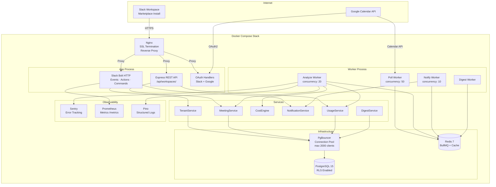

### Service Decomposition

The system is split into two separate Node.js processes:

| Process | Entry Point | Responsibility |
|---|---|---|
| **App** | `src/app.ts` | HTTP server — Slack Bolt, REST API, OAuth handlers |
| **Worker** | `src/worker.ts` | BullMQ workers — poll, analyze, notify, digest |

This separation means workers can crash and restart independently of the HTTP layer, and both can be scaled horizontally.

---

## 3. Technology Stack

| Layer | Technology | Version | Purpose |
|---|---|---|---|
| Language | TypeScript | 6.x | Type-safe backend |
| HTTP Framework | Express + Slack Bolt | 5.x / 4.x | HTTP server + Slack event handling |
| Database | PostgreSQL | 15-alpine | Primary data store with RLS |
| ORM | Prisma | 5.x | Type-safe DB access + migrations |
| Connection Pool | PgBouncer | latest | Multiplexes 2000 app connections to 40 real DB connections |
| Queue | BullMQ | 5.x | Distributed job queues backed by Redis |
| Cache / Broker | Redis | 7-alpine | BullMQ persistence + repeatable jobs |
| Encryption | Node.js `crypto` | built-in | AES-256-GCM for all stored tokens |
| Validation | Zod | 4.x | Env var and input schema validation |
| Logging | Pino | 10.x | Structured JSON logging with PII redaction |
| Error Tracking | Sentry | 10.x | Production error capture per workspace |
| Metrics | prom-client | 15.x | Prometheus metrics endpoint |
| Auth | jsonwebtoken | 9.x | Signed state params for OAuth CSRF prevention |
| Rate Limiting | express-rate-limit | 8.x | Per-endpoint request throttling |
| Security Headers | Helmet | 8.x | CSP, HSTS, X-Frame-Options |
| Reverse Proxy | Nginx | alpine | SSL termination, /metrics isolation |
| Containerisation | Docker + Compose | 3.8 | Full local stack + production deployment |
| Scheduling | node-cron | 4.x | Monthly credit reset cron |
| Calendar | Google APIs | 171.x | Read-only Google Calendar access |
| Slack SDK | @slack/bolt | 4.x | Events, actions, commands, Block Kit |

---

## 4. Data Flow

### End-to-End Meeting Analysis Pipeline

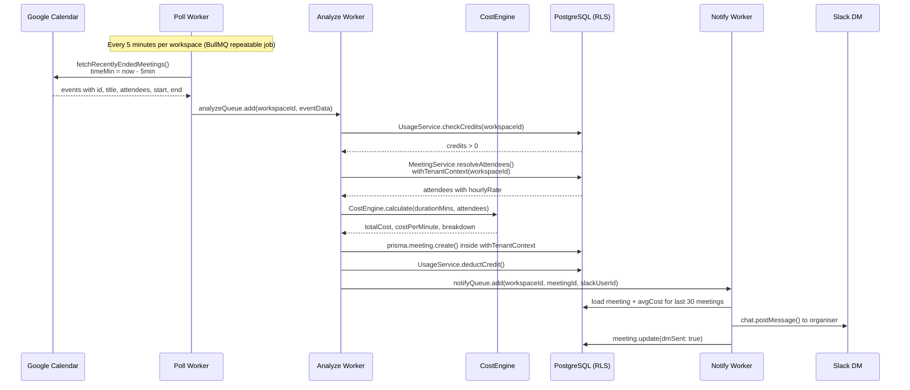

### Workspace Onboarding Flow

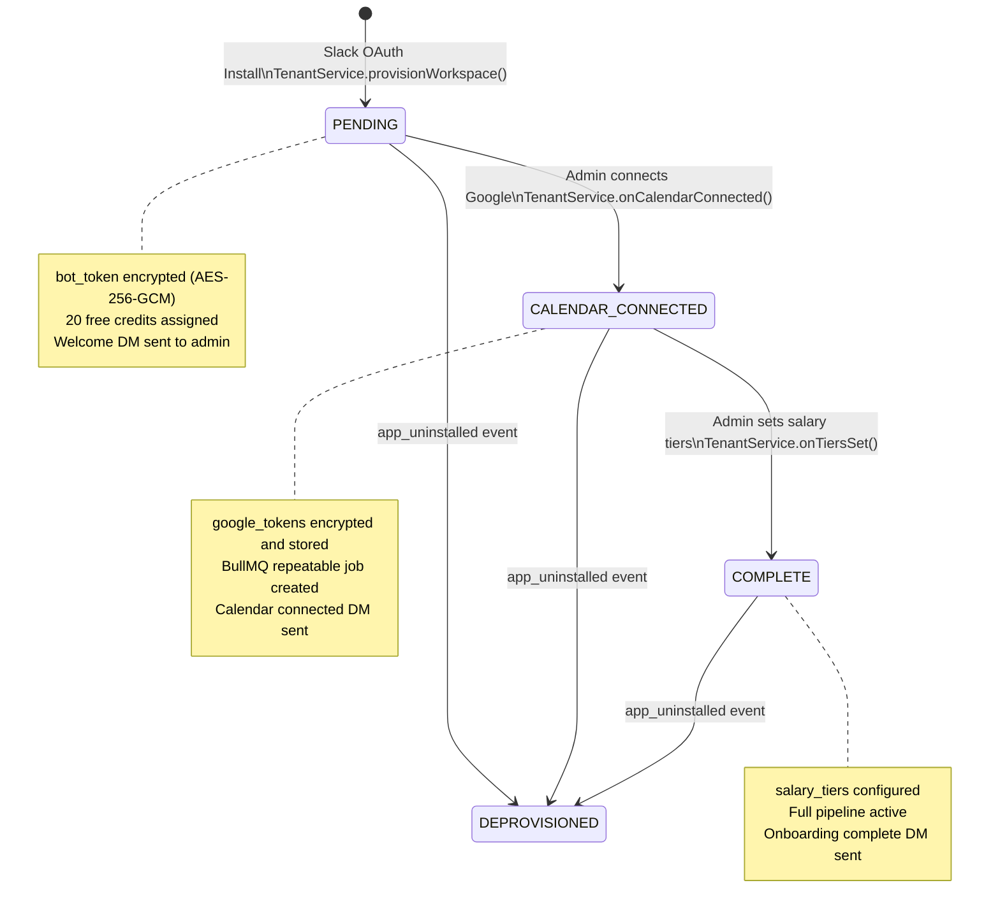

---

## 5. Database Design

### Entity-Relationship Diagram

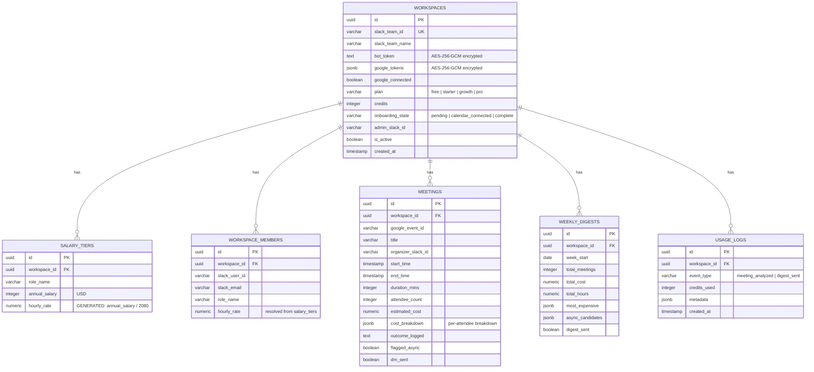

### Row-Level Security (RLS)

Every table (except `workspaces`) is protected by a PostgreSQL RLS policy. No query can return data for a workspace other than the one set in the current transaction context.

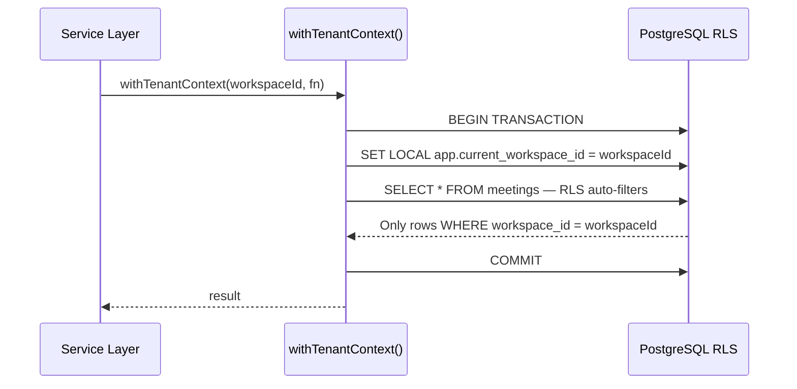

**Why `SET LOCAL` (not `SET`)?** PgBouncer runs in transaction-pooling mode — the connection is returned to the pool after each transaction. `SET LOCAL` scopes the variable to the transaction only, preventing the context from leaking to the next client that reuses the connection.

**Multi-tenancy strategy comparison:**

| Strategy | Data Isolation | Operational Cost | Chosen |
|---|---|---|---|
| Separate DB per tenant | Strongest | Very High | No |
| Separate schema per tenant | Strong | High | No |
| Shared schema + PostgreSQL RLS | Strong (DB-enforced) | Low | **Yes** |
| Shared schema + app-level filters only | Weak | Lowest | No |

---

## 6. Job Queue Architecture

### Queue Topology

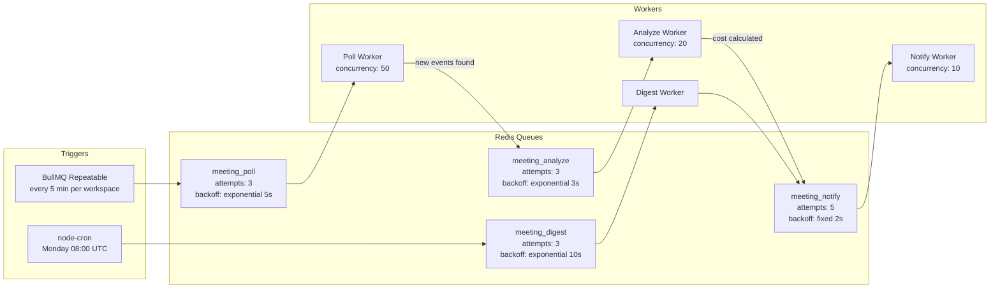

### Worker Responsibilities

| Worker | Queue | Concurrency | What It Does |
|---|---|---|---|
| **Poll Worker** | `meeting_poll` | 50 | Fetches recently ended meetings from Google Calendar per workspace. Deduplicates by `googleEventId`. |
| **Analyze Worker** | `meeting_analyze` | 20 | Checks credits → resolves attendee rates → calculates cost → persists meeting → deducts credit → enqueues notification. |
| **Notify Worker** | `meeting_notify` | 10 | Sends post-meeting DM to organiser via Slack API using the workspace's own bot token. |
| **Digest Worker** | `meeting_digest` | — | Builds weekly digest aggregate → sends Monday morning DM to admin. |

### Per-Workspace Scheduling

Each workspace gets its own BullMQ repeatable job — not a single global cron. This means:
- 500 workspaces = 500 independent poll jobs, running at staggered intervals
- A failure in one workspace's job does not affect others
- Jobs are deduplicated by `jobId: poll-${workspaceId}`

When a workspace is deprovisioned (`app_uninstalled`), its repeatable job is removed from Redis immediately.

---

## 7. Google Calendar Integration

### OAuth 2.0 Flow

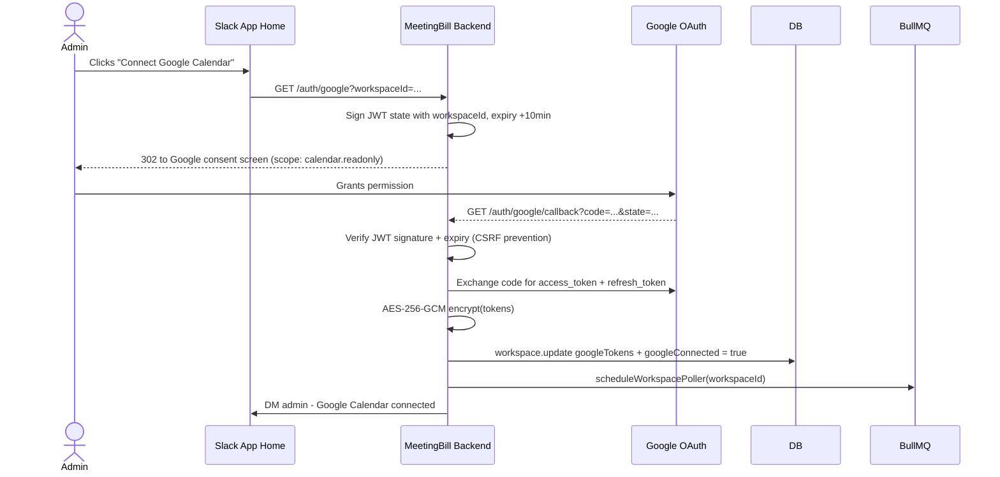

### Token Auto-Refresh

The Google OAuth2 client handles token refresh transparently. When an `access_token` expires, the client uses the stored `refresh_token` automatically. A `tokens` event listener re-encrypts and persists refreshed tokens back to the database — no manual refresh logic required.

### Privacy by Design

The Calendar API call explicitly fetches only the minimum required fields:

```
fields = 'items(id, summary, start, end, attendees, organizer)'
```

Meeting **descriptions** and **attachments** are never requested, stored, or logged. Only title, time, and attendee list are used.

---

## 8. Slack Bot & UX

### Post-Meeting DM (Block Kit)

Sent to the meeting organiser within 5 minutes of the meeting ending:

```
┌──────────────────────────────────────────────────────┐
│ ✅  Product Planning Sync — just ended               │
│ ─────────────────────────────────────────────────── │
│  👥 Attendees: 6          ⏱️ Duration: 45 minutes   │
│  💸 Estimated Cost: $540  📊 Your Avg: $380          │
│                                                      │
│  ⚠️ This ran 42% above your average meeting cost    │
│ ─────────────────────────────────────────────────── │
│  [✅ Worth it]  [🔄 Should be async]  [📝 Log outcome] │
└──────────────────────────────────────────────────────┘
```

### Weekly Digest DM

Sent every Monday at 08:00 UTC to the workspace admin:

```
┌──────────────────────────────────────────────────────┐
│ 📊  Your Meeting Cost Report — Week of Apr 7         │
│                                                      │
│  Total Meetings: 12        Total Cost: $3,240        │
│  Time in Meetings: 9.4h    Cost vs Last Week: ▲ 12% │
│                                                      │
│  🔴  Most Expensive                                  │
│      All-Hands Sync  →  $1,100  (14 people)         │
│      Product Review  →  $740   (9 people)           │
│                                                      │
│  💡  Async Candidates (low outcome rate)             │
│      Status Update   →  $280   (flagged 3x)         │
│      Weekly Sync     →  $420   (0 outcomes)         │
│                                                      │
│  [📈 View Full Report]                               │
└──────────────────────────────────────────────────────┘
```

### Slash Commands

| Command | Description |
|---|---|
| `/meetingbill report` | Get your weekly cost digest on demand |
| `/meetingbill setup` | Open the admin setup wizard |
| `/meetingbill credits` | Check remaining analysis credits |
| `/meetingbill connect` | Connect Google Calendar |
| `/meetingbill help` | Show all available commands |

### App Home Tab (State-Aware)

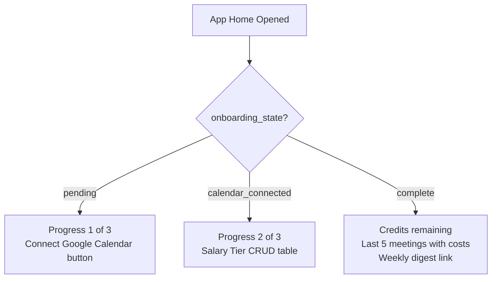

---

## 9. Cost Calculation Engine

### Formula

```
Meeting Cost = sum of (attendee_hourly_rate x duration_hours) for each attendee

Where:
  attendee_hourly_rate = annual_salary / 2080   (2080 working hours per year)
  duration_hours       = duration_minutes / 60
```

The `hourly_rate` column in `salary_tiers` is a PostgreSQL **generated column** — computed from `annual_salary` at the database level and always consistent.

### Attendee Rate Resolution (4-Level Fallback)

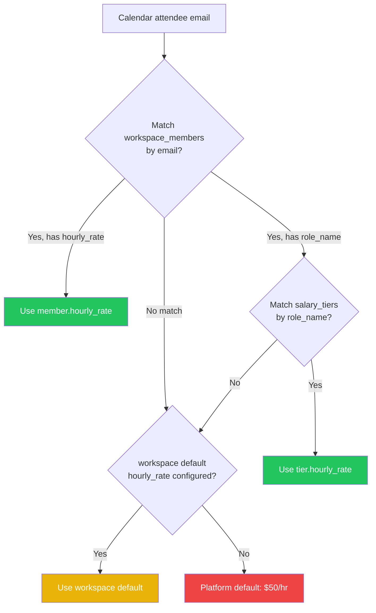

### Implementation

`CostEngine` is a pure stateless class — no I/O, no side effects — making it trivially unit-testable:

```typescript
// src/services/CostEngine.ts
export class CostEngine {
  static calculate(durationMinutes: number, attendees: AttendeeInput[]): CostResult {
    const durationHours = durationMinutes / 60;
    const breakdown = attendees.map(a => ({
      slackUserId: a.slackUserId,
      hourlyRate: a.hourlyRate,
      cost: parseFloat((a.hourlyRate * durationHours).toFixed(2))
    }));
    const totalCost = parseFloat(breakdown.reduce((sum, a) => sum + a.cost, 0).toFixed(2));
    return {
      totalCost,
      costPerMinute: durationMinutes > 0
        ? parseFloat((totalCost / durationMinutes).toFixed(4))
        : 0,
      breakdown
    };
  }
}
```

---

## 10. Multi-Tenancy & Security

### Tenant Isolation

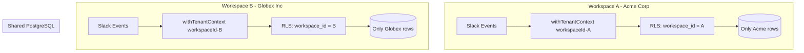

RLS is enforced at the **database engine level** — an application bug cannot cause cross-tenant data leakage.

### Security Controls

| Control | Implementation |
|---|---|
| Slack webhook verification | Bolt verifies `x-slack-signature` on every inbound request automatically |
| Google OAuth CSRF | State param is a JWT signed with `JWT_SECRET`, 10-minute expiry |
| Token encryption | AES-256-GCM — all `bot_token` and `google_tokens` values encrypted at rest |
| DB user privileges | `meetingbill_app` role: SELECT/INSERT/UPDATE/DELETE only; no DDL, no BYPASSRLS |
| Row-Level Security | PostgreSQL RLS enforced at the DB engine — not just application code |
| IDOR prevention | Block Kit action handlers verify `meetingId` belongs to the acting user's workspace |
| Security headers | Helmet.js — CSP, HSTS, X-Frame-Options, Referrer-Policy |
| Rate limiting | Per-endpoint limits via `express-rate-limit` |
| Secrets management | Environment variables only; validated at startup via Zod; never logged |
| PII in logs | Pino `redact` config strips `googleTokens`, `botToken`, `email`, `password` |
| Meeting privacy | Descriptions and attachments never requested, read, or stored |
| Worker isolation | Workers run as a separate process — no direct access to the HTTP layer |

### Token Encryption (AES-256-GCM)

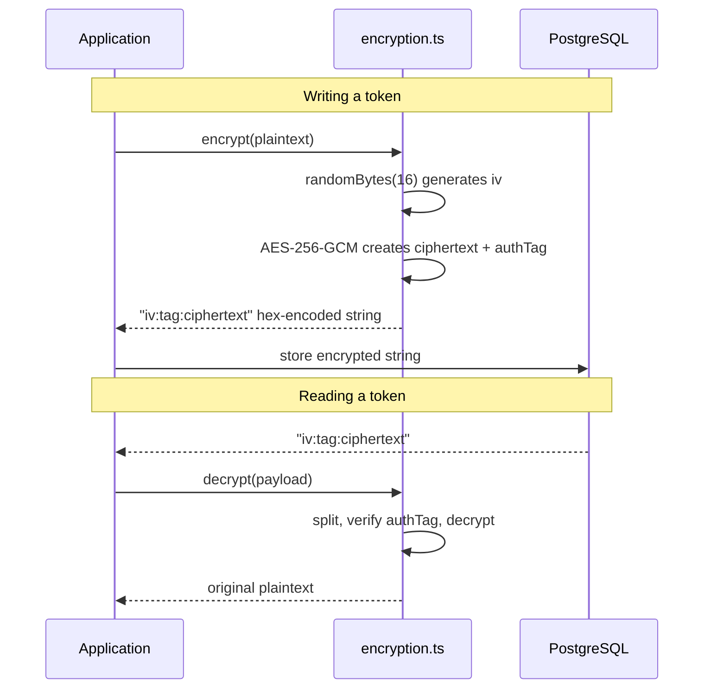

---

## 11. Observability

### Three Pillars

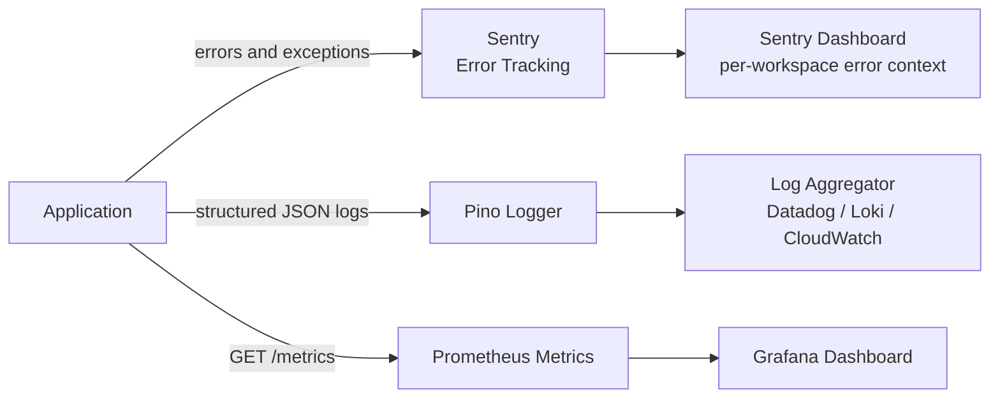

### Prometheus Metrics

| Type | Metric Name | Labels | Description |
|---|---|---|---|
| Counter | `meetingbill_meetings_analyzed_total` | `workspace_id`, `plan` | Total meetings processed |
| Counter | `meetingbill_poll_runs_total` | — | Calendar poll executions |
| Histogram | `meetingbill_meeting_cost_usd` | — | Cost distribution (buckets: $50–$5000) |
| Gauge | `meetingbill_active_workspaces` | — | Currently active workspaces |
| Gauge | `meetingbill_queue_depth` | `queue_name` | Jobs waiting per queue |
| Histogram | `meetingbill_workspace_credits` | — | Credit balance distribution |

The `/metrics` endpoint is restricted to internal network IPs only (10.x, 172.16.x, 192.168.x) via Nginx — it is never publicly accessible.

### Health Check

`GET /health` returns `200 OK` when the database is reachable:

```json
{
  "status": "ok",
  "db": "verified_active",
  "uptime": 3600.5,
  "timestamp": "2026-05-20T10:00:00.000Z"
}
```

Returns `503` if the database connection fails.

### Structured Log Format

All logs are JSON with `workspaceId` for tenant traceability. PII is automatically redacted:

```json
{
  "level": "info",
  "workspaceId": "uuid-here",
  "meetingId": "uuid-here",
  "cost": 420.50,
  "event": "meeting_analyzed",
  "time": 1748000000000
}
```

---

## 12. API Reference

### Endpoints

| Method | Path | Auth | Description |
|---|---|---|---|
| `GET` | `/health` | None | Health check + DB ping |
| `GET` | `/metrics` | Internal only | Prometheus metrics |
| `GET` | `/slack/install` | None | Slack OAuth install redirect |
| `GET` | `/slack/oauth_redirect` | None | Slack OAuth callback |
| `GET` | `/auth/google` | Slack token | Google OAuth redirect |
| `GET` | `/auth/google/callback` | State JWT | Google OAuth callback |
| `POST` | `/slack/events` | Signing secret | Slack Events API webhook |
| `POST` | `/slack/interactions` | Signing secret | Slack Block Kit interactions |
| `GET` | `/api/workspaces/:id/report` | Bot token | Weekly report data |
| `POST` | `/api/workspaces/:id/salary-tiers` | Bot token | Add salary tier |
| `GET` | `/api/workspaces/:id/salary-tiers` | Bot token | List salary tiers |
| `DELETE` | `/api/workspaces/:id/salary-tiers/:tierId` | Bot token | Delete salary tier |
| `GET` | `/api/workspaces/:id/credits` | Bot token | Credit balance |
| `GET` | `/api/workspaces/:id/meetings` | Bot token | Recent meetings |

### Rate Limits

| Limiter | Limit | Key |
|---|---|---|
| Slack webhooks | 500 req/min | `x-slack-team-id` header |
| REST API | 100 req/min | `workspaceId` URL param |
| OAuth flows | 20 req / 15 min | IP address |

---

## 13. Monetisation & Credit System

### Pricing Tiers

| Plan | Price | Credits/Month | Best For |
|---|---|---|---|
| **Free** | $0 | 20 | Try it — approximately 20 meetings |
| **Starter** | $9/mo | 200 | Small teams (10–30 people) |
| **Growth** | $29/mo | 1,000 | Mid-size teams (30–100 people) |
| **Pro** | $79/mo | Unlimited | Large orgs (100+ people) |

**1 credit = 1 meeting analysed**

### Credit Lifecycle

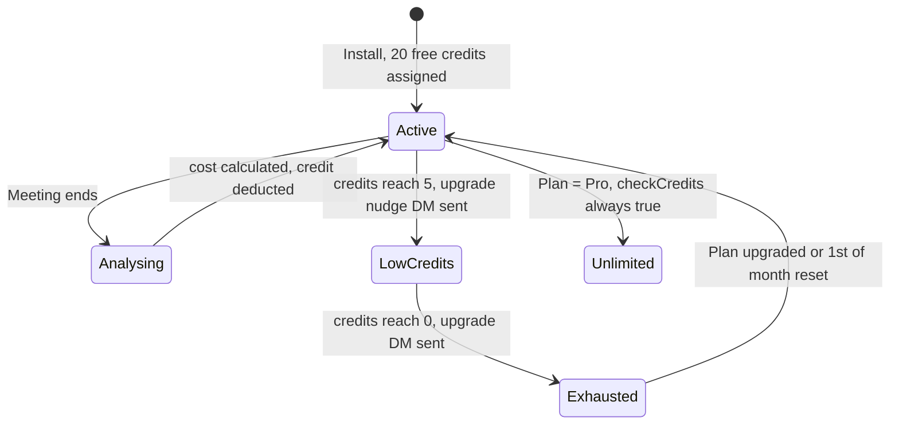

### Credit Reset (Monthly Cron)

A `node-cron` job fires on the 1st of each month at midnight UTC:
- `starter` workspaces → reset to 200 credits
- `growth` workspaces → reset to 1,000 credits
- `pro` workspaces → always unlimited (no reset needed)

---

## 14. Project Structure

```
meetingbill-ai/
├── src/
│   ├── app.ts                        # Slack Bolt + Express entry point
│   ├── worker.ts                     # BullMQ workers entry point
│   ├── scheduler.ts                  # node-cron monthly credit reset
│   │
│   ├── config/
│   │   ├── env.ts                    # Zod env schema — fails fast on missing vars
│   │   └── redis.ts                  # ioredis singleton for BullMQ
│   │
│   ├── db/
│   │   └── prisma.ts                 # Prisma client singleton
│   │
│   ├── middleware/
│   │   ├── tenantContext.ts          # withTenantContext() — RLS context setter
│   │   ├── rateLimiter.ts            # express-rate-limit configurations
│   │   └── auth.ts                   # Bot token verification middleware
│   │
│   ├── services/
│   │   ├── TenantService.ts          # Workspace provisioning + onboarding state machine
│   │   ├── MeetingService.ts         # Meeting fetch + 4-level attendee rate resolution
│   │   ├── CostEngine.ts             # Pure cost calculation (no I/O)
│   │   ├── NotificationService.ts    # Slack DM composer + sender
│   │   ├── DigestService.ts          # Weekly digest aggregate builder
│   │   └── UsageService.ts           # Credit check, deduction, monthly reset
│   │
│   ├── queues/
│   │   ├── index.ts                  # Queue definitions + scheduleWorkspacePoller()
│   │   └── workers/
│   │       ├── pollWorker.ts         # Google Calendar poller (concurrency 50)
│   │       ├── analyzeWorker.ts      # Meeting cost analyser (concurrency 20)
│   │       ├── notifyWorker.ts       # Slack DM sender (concurrency 10)
│   │       └── digestWorker.ts       # Weekly digest sender
│   │
│   ├── slack/
│   │   ├── oauth.ts                  # Slack OAuth install + redirect handlers
│   │   ├── interactions.ts           # Block Kit interaction router
│   │   ├── handlers/
│   │   │   ├── appHome.ts            # App Home tab renderer (state-aware)
│   │   │   ├── commands.ts           # /meetingbill slash command handler
│   │   │   └── actions.ts            # Button actions + outcome modal
│   │   └── blocks/
│   │       ├── appHomeTabs.ts        # App Home Block Kit blocks
│   │       └── weeklyDigest.ts       # Weekly digest Block Kit blocks
│   │
│   ├── google/
│   │   ├── auth.ts                   # OAuth2 client factory + auto token refresh
│   │   └── calendar.ts               # Calendar event fetcher (privacy-scoped)
│   │
│   ├── routes/
│   │   ├── auth.ts                   # /auth/google/* OAuth routes
│   │   └── api.ts                    # /api/workspaces/* REST routes
│   │
│   └── utils/
│       ├── encryption.ts             # AES-256-GCM encrypt/decrypt
│       ├── logger.ts                 # Pino structured logger with PII redaction
│       └── metrics.ts                # Prometheus metrics registry
│
├── prisma/
│   └── schema.prisma                 # Prisma schema (6 models)
│
├── db/
│   └── init.sql                      # RLS policies + DB roles setup
│
├── nginx/
│   ├── nginx.conf                    # Reverse proxy + SSL + /metrics isolation
│   └── certs/                        # TLS certificates
│
├── Docs/
│   ├── meetingbill-ai-production-system-design.md
│   └── meetingbill-implementation-plan.md
│
├── docker-compose.yml                # Full stack: app, worker, db, pgbouncer, redis, nginx
├── Dockerfile                        # Multi-stage build (builder to production)
├── .env.example                      # All required env vars with generation commands
├── package.json
└── tsconfig.json
```

---

## 15. Local Development

### Prerequisites

- Node.js 20+
- Docker + Docker Compose
- A Slack app with credentials (see below)
- A Google Cloud project with OAuth credentials

### 1. Slack App Setup

Go to [api.slack.com/apps](https://api.slack.com/apps) and create a new app.

**OAuth Scopes (Bot Token):**
```
chat:write
commands
app_mentions:read
im:write
users:read
users:read.email
app_home:read
app_home:write
```

**Slash Commands:** Add `/meetingbill`

**Event Subscriptions:**
```
app_home_opened
app_uninstalled
```

**OAuth Redirect URL:** `https://yourdomain.com/slack/oauth_redirect`

### 2. Google Cloud Setup

Go to [console.cloud.google.com](https://console.cloud.google.com):
- Create a project, enable the **Google Calendar API**
- Create OAuth 2.0 credentials (Web application type)
- Add redirect URI: `https://yourdomain.com/auth/google/callback`
- Scope: `https://www.googleapis.com/auth/calendar.readonly`

### 3. Environment Configuration

```bash
cp .env.example .env
```

Generate all secrets:

```bash
# ENCRYPTION_KEY (must be exactly 64 hex chars = 32 bytes)
openssl rand -hex 32

# All other secrets
openssl rand -base64 48
```

Fill in your Slack and Google credentials in `.env`.

### 4. Start the Stack

```bash
# Full stack with Docker Compose
docker-compose up --build

# Or: run infrastructure in Docker, app/worker in native Node.js for hot-reload
docker-compose up db pgbouncer redis
npm run dev      # App server with hot-reload
npm run worker   # Worker process
```

### 5. Database Migrations

```bash
npx prisma migrate deploy   # apply pending migrations
npx prisma studio           # visual DB explorer at localhost:5555
```

### Available Scripts

| Script | Command | Description |
|---|---|---|
| `build` | `tsc` | Compile TypeScript to `dist/` |
| `start` | `node dist/app.js` | Production app server |
| `dev` | `ts-node-dev src/app.ts` | Development with hot-reload |
| `worker` | `node dist/worker.js` | BullMQ worker process |

---

## 16. Docker Deployment

### Service Architecture

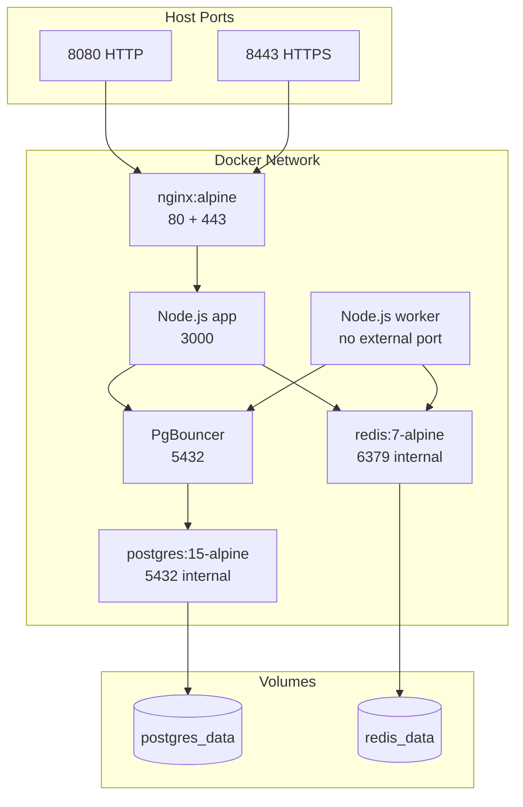

### Multi-Stage Dockerfile

```
Stage 1 (builder):    node:20-alpine → npm ci → tsc → compiled JS in dist/
Stage 2 (production): node:20-alpine → npm ci --only=production
                      copy dist/ + prisma/ → USER node (non-root)
CMD: prisma migrate deploy && node dist/app.js
```

### Start Full Stack

```bash
docker-compose up -d --build

# Scale workers horizontally
docker-compose up -d --scale worker=3
```

### Health Checks

Every service has Docker health checks configured:
- **PostgreSQL**: `pg_isready -U postgres` every 10s
- **Redis**: `redis-cli ping` every 10s
- **App**: `curl http://localhost:3000/health` every 30s

The `app` and `worker` services use `depends_on: condition: service_healthy` — they wait for both database and Redis to be fully ready before starting.

---

## 17. Environment Variables

| Variable | Generation | Description |
|---|---|---|
| `NODE_ENV` | `production` | Runtime environment |
| `APP_URL` | `https://meetingbill.app` | Public base URL |
| `DATABASE_URL` | — | PgBouncer connection string |
| `REDIS_URL` | — | Redis connection string |
| `REDIS_PASSWORD` | `openssl rand -base64 48` | Redis auth password |
| `DB_PASSWORD` | `openssl rand -base64 48` | App DB user password |
| `DB_ROOT_PASSWORD` | `openssl rand -base64 48` | PostgreSQL root password |
| `ENCRYPTION_KEY` | `openssl rand -hex 32` | 64-char hex (32 bytes) — AES-256-GCM key |
| `JWT_SECRET` | `openssl rand -base64 48` | Google OAuth state signing key |
| `SLACK_CLIENT_ID` | from api.slack.com/apps | Slack app client ID |
| `SLACK_CLIENT_SECRET` | from api.slack.com/apps | Slack app client secret |
| `SLACK_SIGNING_SECRET` | from api.slack.com/apps | Webhook signature verification |
| `GOOGLE_CLIENT_ID` | from console.cloud.google.com | Google OAuth client ID |
| `GOOGLE_CLIENT_SECRET` | from console.cloud.google.com | Google OAuth client secret |
| `SENTRY_DSN` | from sentry.io | Error tracking DSN (optional) |
| `LOG_LEVEL` | `info` | Pino log level: debug / info / warn / error |

---

## 18. Future Roadmap

| Feature | Description | Priority |
|---|---|---|
| **Stripe integration** | Credit purchase flow with webhooks + automatic top-up | High |
| **Outlook / Teams support** | Microsoft Graph API calendar integration | High |
| **AI ROI Scoring** | LLM scores meeting value from logged outcomes (e.g. Gemini Flash) | Medium |
| **Channel digest** | Optional public weekly cost report posted to a team channel | Medium |
| **HRIS sync** | Pull roles + salaries directly from BambooHR / Workday | Medium |
| **Anomaly alerts** | Alert when team meeting cost spikes >30% week-over-week | Low |
| **Async suggestions** | Auto-suggest converting low-ROI recurring meetings to async | Low |
| **PDF / CSV export** | Download meeting cost reports for finance teams | Low |
| **SSO / SCIM** | SAML + SCIM for enterprise workspace management | Low |
| **Audit logs** | Immutable per-tenant audit trail for enterprise compliance | Low |
| **Dedicated infra** | Isolated DB schema option for large enterprise tenants | Low |

---

## Contributing

1. Fork the repository
2. Create a feature branch: `git checkout -b feat/your-feature`
3. Commit using conventional commits: `feat: add outlook support`
4. Open a pull request against `main`

Please ensure:
- No secrets or API keys in committed code
- Zod schemas updated for any new env vars
- All queries use `withTenantContext()` for tenant-scoped tables
- No `console.log` in production code — use the Pino logger

## License

[ISC](LICENSE)

---

*MeetingBill AI v2.0 — Making the invisible cost of meetings visible, at scale.*
